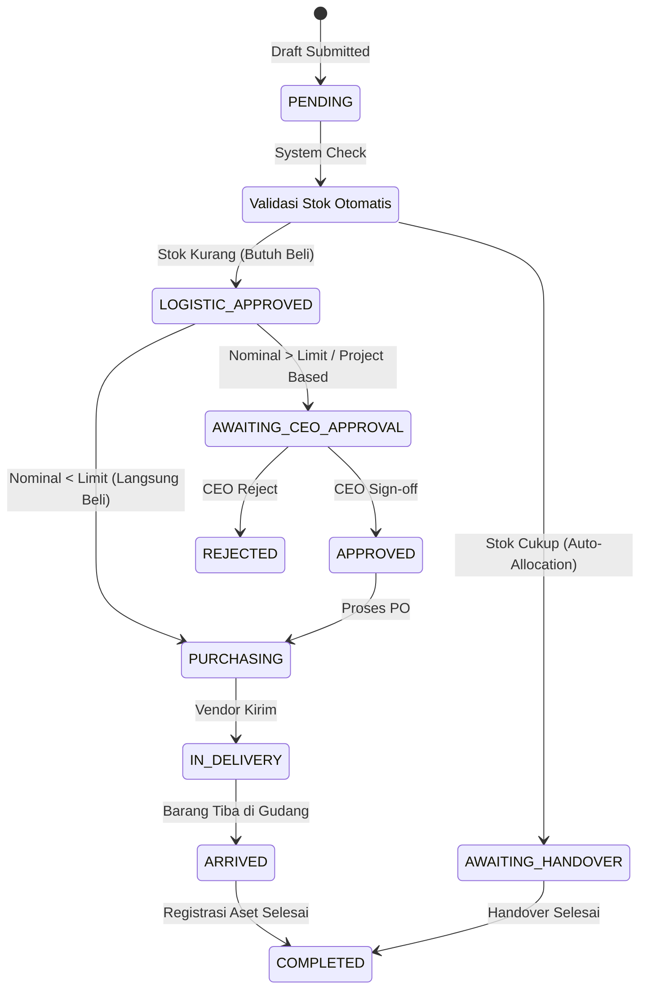
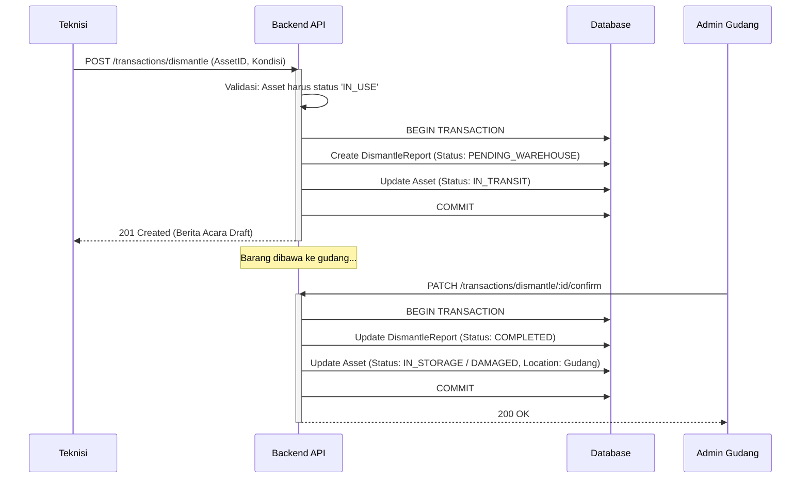
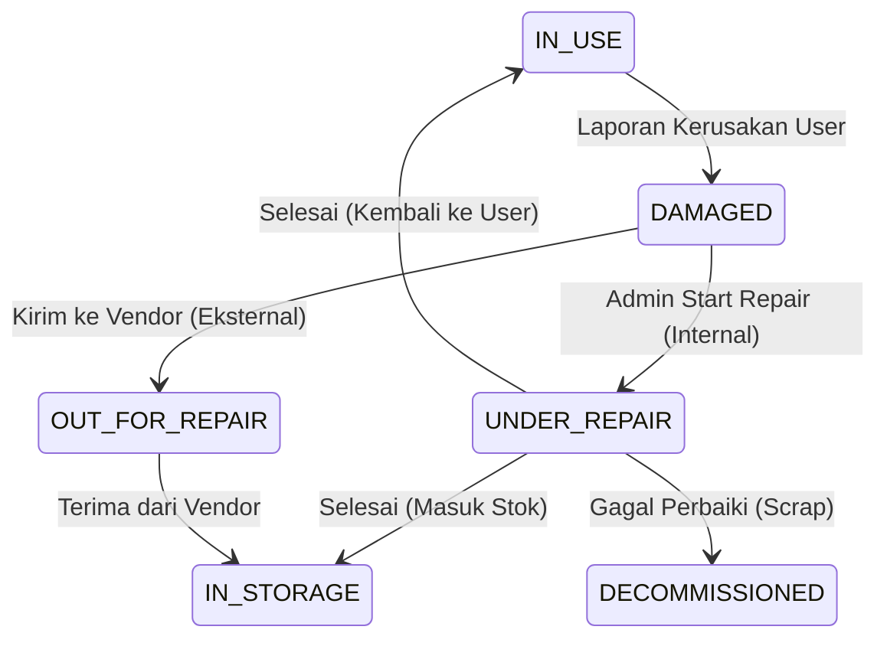

# Alur Logika Bisnis & Fungsional (End-to-End)

Dokumen ini memetakan alur kerja pengguna (User Flow) dan logika sistem (System Logic) untuk modul-modul kritis dalam TrinityApps. Dokumen ini berfungsi sebagai acuan utama bagi pengembang Backend untuk mengimplementasikan *Business Rules* dan *State Management*.

---

## 1. Modul Pengadaan (Procurement & Request)

Modul ini menangani siklus hidup permintaan barang baru, mulai dari pengajuan oleh staf hingga barang tiba dan dicatat.

### 1.1. Diagram Transisi Status (Request Lifecycle)



### 1.2. Alur Detil

| Tahap | Lajur Pengguna (Frontend) | Lajur Logika (Backend Service) | Edge Cases & Validasi |
| :--- | :--- | :--- | :--- |
| **1. Pengajuan** | Staf memilih item dan kuantitas. Klik "Ajukan". | 1. Terima DTO `CreateRequest`.<br>2. **Atomic Transaction**: Query tabel `Asset` (status: `IN_STORAGE`) untuk cek ketersediaan.<br>3. Jika stok >= request, set status item `STOCK_ALLOCATED`.<br>4. Jika kurang, set `PROCUREMENT_NEEDED`. | Jika User adalah 'Staff', paksa tipe order 'Regular'. Leader boleh 'Urgent'. |
| **2. Review Logistik** | Admin Logistik melihat request PENDING. Mengedit qty jika perlu. Klik "Approve". | 1. Update status request -> `LOGISTIC_APPROVED`.<br>2. Trigger notifikasi WhatsApp ke grup Purchasing.<br>3. Jika ada revisi qty, catat di `ActivityLog`. | Jika semua item ditolak (qty=0), status otomatis `REJECTED`. |
| **3. Pembelian** | Admin Purchase input data PO, Vendor, Harga. Klik "Mulai Pengadaan". | 1. Validasi kelengkapan data pembelian (Harga, Vendor).<br>2. Update status -> `PURCHASING`. | Validasi budget (jika ada modul budget). |
| **4. Penerimaan (Staging)** | Admin Logistik klik "Barang Tiba". Membuka menu Staging. | 1. Update status -> `ARRIVED`.<br>2. Siapkan data *pre-fill* untuk registrasi aset. | Barang rusak saat diterima? (Masuk alur Return Vendor - *Future Dev*). |
| **5. Konversi Aset** | Admin input SN/Mac Address. Klik "Simpan Aset". | 1. **Db Transaction**: <br>   a. Create `Asset` baru.<br>   b. Update `Request` (isRegistered = true, status = `COMPLETED`).<br>   c. Create `ActivityLog` (Asset Created). | Rollback semua jika insert Asset gagal. |

---

## 2. Modul Peminjaman (Loan & Assignment)

Mengatur peminjaman aset dari gudang ke staf (sementara) atau handover permanen.

### 2.1. Logic Flow: Pencegahan Race Condition

Masalah utama dalam sistem inventori adalah dua orang mencoba meminjam aset fisik yang sama pada waktu bersamaan.

**Mekanisme Backend:**
1.  Admin membuka panel "Penetapan Aset".
2.  Backend mengirim daftar aset `IN_STORAGE`.
3.  Admin memilih Asset ID `AST-001` dan klik "Simpan".
4.  **Backend Validation (Critical):**
    ```typescript
    await prisma.$transaction(async (tx) => {
        const asset = await tx.asset.findUnique({ where: { id: 'AST-001' } });
        if (asset.status !== 'IN_STORAGE') {
            throw new Error('Asset no longer available'); // Race condition caught
        }
        await tx.asset.update({ ...status: 'IN_USE', currentUser: requesterId... });
        await tx.loanRequest.update({ ...status: 'ON_LOAN'... });
    });
    ```

---

## 3. Modul Instalasi & Dismantle (Sirkulasi Pelanggan)

Alur pergerakan aset keluar ke pelanggan dan kembali lagi ke gudang.

### 3.1. Sequence Diagram: Dismantle (Penarikan)



### 3.2. Aturan Bisnis (Business Rules)
1.  **Validasi Kepemilikan**: Teknisi hanya bisa melakukan dismantle pada aset yang terdaftar di Customer yang dipilih.
2.  **Material Habis Pakai**: Kabel atau konektor yang di-dismantle tidak masuk kembali ke stok sebagai unit baru, melainkan masuk kategori *Scrap/Limbah* atau stok *Refurbished* (perlu penanganan khusus pada tipe item `Bulk`).

---

## 4. Modul Perbaikan (Maintenance & Repair)

### 4.1. Transisi Status Perbaikan


### 4.2. Logika Biaya & Riwayat
*   Setiap kali status berubah menjadi `COMPLETED` dari perbaikan, sistem harus mencatat `repairCost` (jika ada) ke dalam `MaintenanceLog`.
*   Nilai aset (Book Value) secara default **tidak bertambah** dengan perbaikan, kecuali ditandai sebagai *Capital Expenditure (Capex)* upgrading.