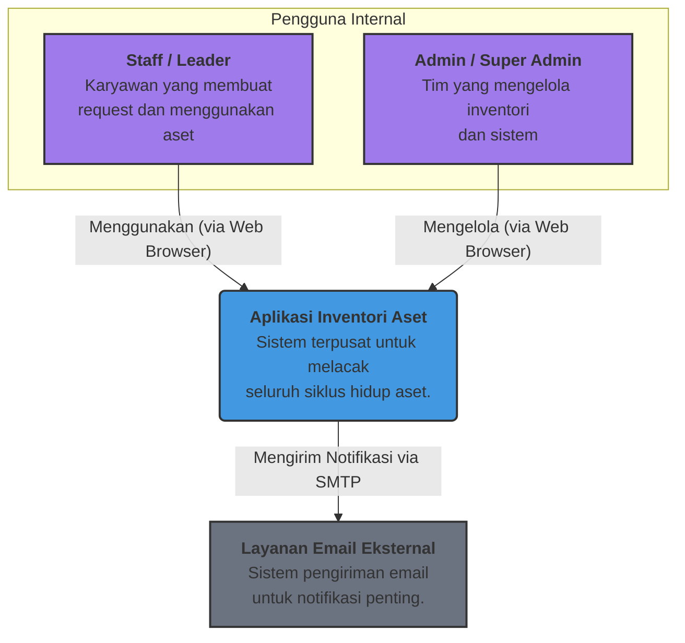
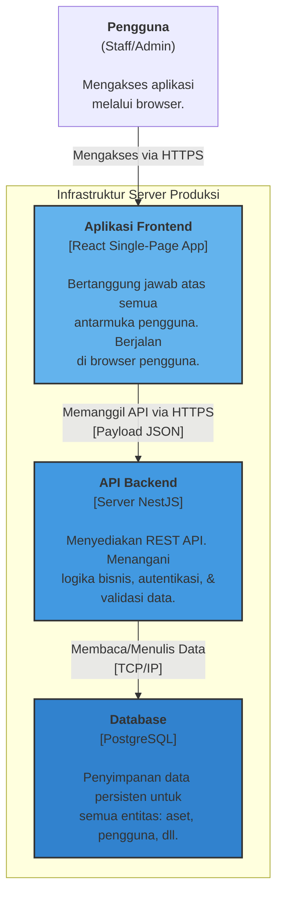
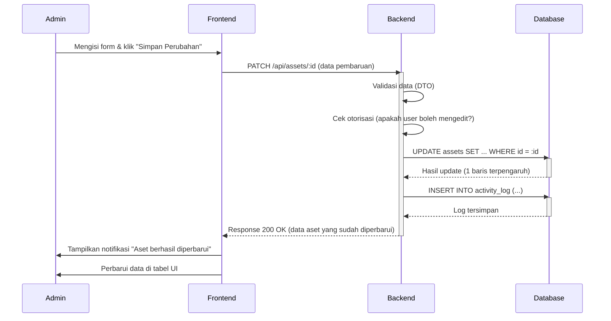

# Diagram Sistem

Dokumen ini adalah repositori visual untuk semua diagram arsitektur utama yang digunakan dalam proyek Aplikasi Inventori Aset. Diagram-diagram ini dibuat menggunakan sintaks Mermaid untuk memastikan dokumentasi tetap "hidup" dan mudah diperbarui seiring dengan evolusi kode.

## 1. Diagram C4 - Level 1 (System Context)

Diagram ini menunjukkan gambaran besar: bagaimana sistem "AssetFlow" berinteraksi dengan pengguna dan sistem eksternal lainnya. Tujuannya adalah untuk audiens non-teknis dan teknis agar memahami batasan dan dependensi utama sistem.

## 2. Diagram C4 - Level 2 (Containers)

Diagram ini memperbesar sistem "AssetFlow" untuk menunjukkan komponen-komponen teknis utama (kontainer) yang dapat di-deploy secara terpisah.

## 3. Diagram Alur Data (Data Flow) - Pembaruan Aset

Diagram ini menggambarkan bagaimana data mengalir melalui sistem saat seorang Admin memperbarui informasi sebuah aset. Ini berguna untuk pengembang dalam memahami interaksi antar komponen.

