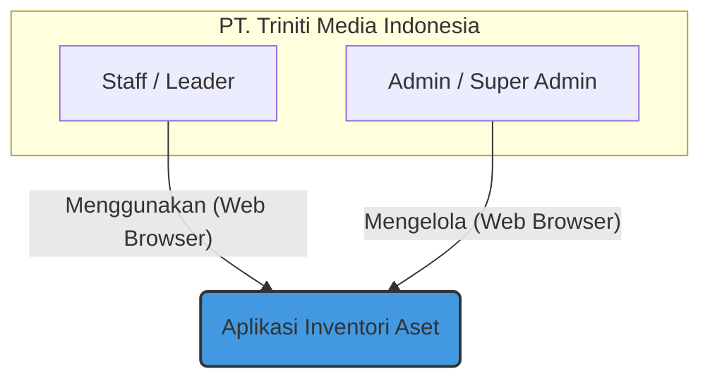
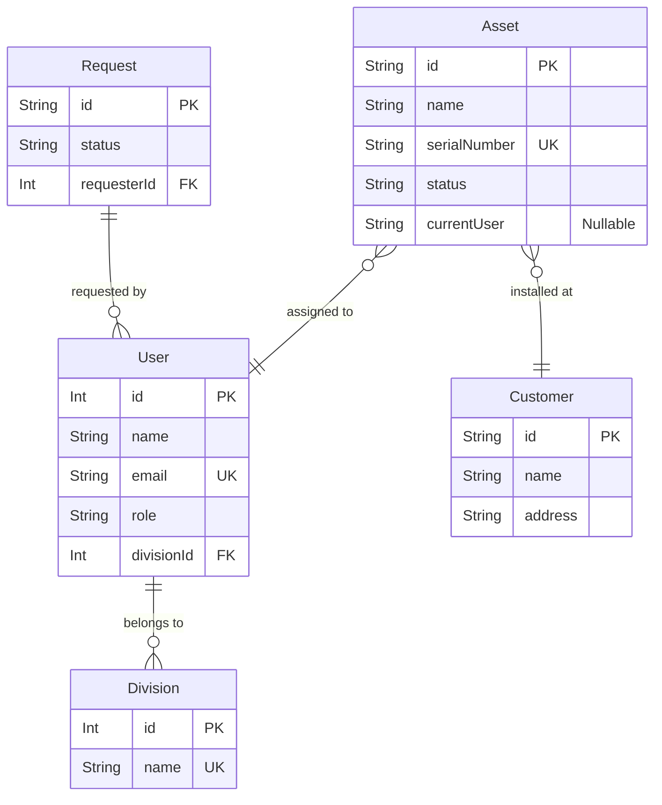

        
  <svg width="120" height="120" viewBox="0 0 24 24" fill="none" xmlns="http://www.w3.org/2000/svg" style="color: #1D4ED8;">
      <path d="M12 21.25a9.5 9.5 0 100-19 9.5 9.5 0 000 19z" stroke="currentColor" stroke-width="1.5" stroke-linecap="round" stroke-linejoin="round"/>
      <path d="M8.5 9.5h7" stroke="currentColor" stroke-width="1.5" stroke-linecap="round" stroke-linejoin="round"/>
      <path d="M12 9.5v6" stroke="currentColor" stroke-width="1.5" stroke-linecap="round" stroke-linejoin="round"/>
  </svg>
  <h1 style="font-family: sans-serif; font-size: 38px; color: #111827; margin-top: 20px;">LAPORAN PERTANGGUNGJAWABAN FINAL</h1>
  <h2 style="font-family: sans-serif; font-size: 24px; color: #1D4ED8; font-weight: 400;">PROYEK PENGEMBANGAN APLIKASI INVENTORI ASET</h2>
     
  
Untuk:

  <h3 style="font-family: sans-serif; font-size: 22px; color: #111827;">PT. TRINITI MEDIA INDONESIA</h3>
         
  
Versi Laporan: 1.3 (Final Polish)

  
Tanggal: 17 Oktober 2025

  
Disusun oleh: Angga Samuludi Septiawan

# Ringkasan Eksekutif

Laporan ini menandai penyelesaian dan serah terima resmi dari proyek pengembangan **Aplikasi Inventori Aset** untuk PT. Triniti Media Indonesia. Proyek ini telah berhasil dilaksanakan sesuai dengan seluruh ruang lingkup, jadwal, dan tujuan yang telah disepakati dalam [Proposal Penawaran (Q-INV/AS/X/2025/001)](./Business/quotation.html) dan dikukuhkan dalam [Perjanjian Kerja (001/SPK-DEV/TMI-AS/X/2025)](./Business/perjanjian.md).

Hasil akhir yang diserahkan adalah sebuah **Prototipe Frontend Fungsional Penuh (*High-Fidelity Functional Frontend Prototype*)**. Aplikasi ini secara komprehensif merealisasikan seluruh antarmuka pengguna (UI/UX) dan alur kerja sisi klien dari sistem manajemen aset yang dirancang. Sistem ini secara spesifik mengatasi tantangan operasional PT. Triniti Media Indonesia dengan mendigitalkan seluruh siklus hidup aset—mulai dari proses permintaan barang, persetujuan multi-level, pencatatan aset baru, serah terima internal, instalasi di lokasi pelanggan, hingga proses penarikan kembali (*dismantle*) dan perbaikan aset.

Dibangun dengan tumpukan teknologi modern yang berorientasi pada masa depan—**React** untuk frontend—aplikasi ini menjamin skalabilitas, performa tinggi, dan kemudahan pemeliharaan. Saat ini, logika bisnis dan penyimpanan data disimulasikan menggunakan **Mock API** yang berjalan di browser, memungkinkan demonstrasi dan pengujian alur kerja secara penuh tanpa ketergantungan pada server.

**Status Validasi & Audit Keamanan (v1.3):**
Tim pengembang telah melakukan audit kode menyeluruh dan memverifikasi integritas sistem:
1.  **Stabilitas Fungsional**: Seluruh modul (Request, Peminjaman, Stok, Perbaikan) telah diverifikasi berjalan sesuai spesifikasi tanpa bug kritis.
2.  **Audit Keamanan**:
    *   **Frontend**: Kontrol Akses Berbasis Peran (RBAC) telah diterapkan dengan ketat pada antarmuka. Pengguna tidak dapat mengakses menu di luar hak akses mereka.
    *   **Backend**: Karena aplikasi saat ini berjalan sebagai *Client-Side Prototype*, keamanan data bergantung pada penyimpanan browser. Untuk deployment produksi, integrasi dengan Backend API (NestJS) yang telah didesain adalah **wajib** untuk menjamin keamanan data server-side.
3.  **Konsistensi Data**: Seluruh data simulasi (Mock Data) telah diselaraskan untuk mencerminkan skenario dunia nyata yang logis.

Bersamaan dengan laporan ini, diserahkan pula seluruh artefak proyek yang mencakup **kode sumber (*source code*)** untuk aplikasi frontend, serta **dokumentasi komprehensif** yang mencakup segala aspek dari arsitektur sistem, panduan pengembangan, standar operasional, hingga panduan pengguna akhir. Penyerahan ini memberikan kepemilikan penuh dan kontrol otonom kepada PT. Triniti Media Indonesia atas aset digital yang sangat berharga ini, serta cetak biru yang jelas untuk penyelesaian proyek menjadi aplikasi *full-stack*.

Laporan ini berfungsi sebagai dokumen warisan (*legacy document*) yang merangkum seluruh perjalanan proyek, dari analisis kebutuhan hingga realisasi teknis, dan memberikan rekomendasi strategis untuk pengembangan di masa depan.

# Daftar Isi

- [Ringkasan Eksekutif](#ringkasan-eksekutif)
- [Daftar Isi](#daftar-isi)
- **BAB 1: PENDAHULUAN**
    - [1.1. Latar Belakang Proyek](#11-latar-belakang-proyek)
    - [1.2. Masalah Bisnis yang Diselesaikan](#12-masalah-bisnis-yang-diselesaikan)
    - [1.3. Visi, Misi, dan Tujuan Proyek](#13-visi-misi-dan-tujuan-proyek)
    - [1.4. Ruang Lingkup dan Batasan Proyek](#14-ruang-lingkup-dan-batasan-proyek)
    - [1.5. Target Pengguna dan Peran (User Persona)](#15-target-pengguna-dan-peran-user-persona)
    - [1.6. Definisi dan Istilah](#16-definisi-dan-istilah)
    - [1.7. Jaminan Kualitas & Profesionalisme: Nilai Investasi Anda](#17-jaminan-kualitas--profesionalisme-nilai-investasi-anda)
- **BAB 2: ANALISIS KEBUTUHAN DAN DESAIN SISTEM**
    - [2.1. Kebutuhan Fungsional](#21-kebutuhan-fungsional)
    - [2.2. Kebutuhan Non-Fungsional](#22-kebutuhan-non-fungsional)
    - [2.3. Arsitektur Sistem Tingkat Tinggi](#23-arsitektur-sistem-tingkat-tinggi)
    - [2.4. Tumpukan Teknologi yang Digunakan](#24-tumpukan-teknologi-yang-digunakan)
    - [2.5. Desain Skema Database (ERD)](#25-desain-skema-database-erd)
    - [2.6. Catatan Keputusan Arsitektural (ADR)](#26-catatan-keputusan-arsitektural-adr)
- **BAB 3: REALISASI DAN IMPLEMENTASI FITUR**
    - [3.1. Modul Dashboard](#31-modul-dashboard)
    - [3.2. Modul Manajemen Permintaan Aset (Request)](#32-modul-manajemen-permintaan-aset-request)
    - [3.3. Modul Manajemen Pencatatan Aset (Registration)](#33-modul-manajemen-pencatatan-aset-registration)
    - [3.4. Modul Manajemen Stok (Stock)](#34-modul-manajemen-stok-stock)
    - [3.5. Modul Manajemen Serah Terima (Handover)](#35-modul-manajemen-serah-terima-handover)
    - [3.6. Modul Manajemen Penarikan (Dismantle)](#36-modul-manajemen-penarikan-dismantle)
    - [3.7. Modul Manajemen Perbaikan Aset (Repair)](#37-modul-manajemen-perbaikan-aset-repair)
    - [3.8. Modul Manajemen Pelanggan (Customers)](#38-modul-manajemen-pelanggan-customers)
    - [3.9. Modul Pengaturan (Settings)](#39-modul-pengaturan-settings)
    - [3.10. Modul Manajemen Peminjaman Aset (Loan)](#310-modul-manajemen-peminjaman-aset-loan)
- **BAB 4: PANDUAN TEKNIS DAN PENGEMBANGAN LANJUTAN**
    - [4.1. Panduan Setup Lingkungan Pengembangan](#41-panduan-setup-lingkungan-pengembangan)
    - [4.2. Arsitektur dan Pola Frontend (React)](#42-arsitektur-dan-pola-frontend-react)
    - [4.3. Arsitektur dan Pola Backend (NestJS)](#43-arsitektur-dan-pola-backend-nestjs)
    - [4.4. Standar Koding dan Kontribusi](#44-standar-koding-dan-kontribusi)
    - [4.5. Referensi API](#45-referensi-api)
    - [4.6. Strategi Pengujian (Testing)](#46-strategi-pengujian-testing)
- **BAB 5: PANDUAN OPERASIONAL DAN KESIAPAN PRODUKSI**
    - [5.1. Panduan Deployment](#51-panduan-deployment)
    - [5.2. Strategi Keamanan](#52-strategi-keamanan)
    - [5.3. Strategi Monitoring dan Logging](#53-strategi-monitoring-dan-logging)
    - [5.4. Rencana Pencadangan dan Pemulihan Bencana](#54-rencana-pencadangan-dan-pemulihan-bencana)
- **BAB 6: PANDUAN PENGGUNA AKHIR**
    - [6.1. Pengenalan Antarmuka](#61-pengenalan-antarmuka)
    - [6.2. Panduan untuk Peran Staff & Manajer](#62-panduan-untuk-peran-staff--manajer)
    - [6.3. Panduan untuk Peran Admin](#63-panduan-untuk-peran-admin)
    - [6.4. Panduan untuk Peran Super Admin](#64-panduan-untuk-peran-super-admin)
- **BAB 7: SERAH TERIMA DAN RENCANA MASA DEPAN**
    - [7.1. Daftar Deliverables yang Diserahkan](#71-daftar-deliverables-yang-diserahkan)
    - [7.2. Masa Garansi dan Dukungan Teknis](#72-masa-garansi-dan-dukungan-teknis)
    - [7.3. Rekomendasi Pengembangan Lanjutan](#73-rekomendasi-pengembangan-lanjutan)
    - [7.4. Peta Jalan Produk (Product Roadmap)](#74-peta-jalan-produk-product-roadmap)
- **LAMPIRAN**
    - [Lampiran A: Salinan Proposal Penawaran](#lampiran-a-salinan-proposal-penawaran)
    - [Lampiran B: Salinan Perjanjian Kerja](#lampiran-b-salinan-perjanjian-kerja)
    - [Lampiran C: Salinan Berita Acara Kerjasama](#lampiran-c-salinan-berita-acara-kerjasama)

## BAB 1: PENDAHULUAN

### 1.1. Latar Belakang Proyek
PT. Triniti Media Indonesia, sebagai perusahaan yang terus berkembang, memiliki jumlah aset fisik yang signifikan, mulai dari perangkat jaringan inti, perangkat pelanggan (CPE), hingga infrastruktur kantor. Pengelolaan aset-aset ini sebelumnya mengandalkan proses manual, seperti penggunaan spreadsheet dan komunikasi verbal, yang terbukti tidak lagi memadai seiring dengan pertumbuhan skala operasional perusahaan.

### 1.2. Masalah Bisnis yang Diselesaikan
Proyek ini secara langsung mengatasi beberapa masalah bisnis kritis:
-   **Ketidakefisienan Operasional**: Proses permintaan barang yang memakan waktu, memerlukan persetujuan manual berjenjang, dan sering kali tidak terdokumentasi dengan baik.
-   **Kurangnya Visibilitas**: Kesulitan untuk mengetahui secara cepat jumlah stok suatu barang, di mana sebuah aset berada, dan siapa yang bertanggung jawab atasnya.
-   **Risiko Kehilangan Aset**: Tanpa sistem pelacakan yang solid, risiko kehilangan atau penyalahgunaan aset menjadi tinggi, yang berujung pada kerugian finansial.
-   **Kesulitan Audit**: Proses audit inventori menjadi sangat lambat dan melelahkan karena data yang tersebar dan tidak terstandarisasi.
-   **Akuntabilitas yang Rendah**: Tidak adanya jejak digital yang jelas mengenai siapa yang menyerahkan dan menerima aset membuat akuntabilitas menjadi lemah.

### 1.3. Visi, Misi, dan Tujuan Proyek
-   **Visi**: Menciptakan ekosistem digital terintegrasi untuk manajemen aset yang memberikan visibilitas penuh dan kontrol atas seluruh siklus hidup aset di PT. Triniti Media Indonesia.
-   **Misi**: Membangun aplikasi web yang intuitif, aman, dan andal yang mendigitalkan semua proses terkait inventori, dari pengadaan hingga penghapusan.
-   **Tujuan Proyek (Tercapai)**:
    1.  **Sentralisasi Data**: Mengumpulkan semua data aset dalam satu database yang terstruktur (✅ **Tercapai**).
    2.  **Otomatisasi Alur Kerja**: Mendigitalkan proses permintaan, persetujuan, serah terima, dan penarikan aset (✅ **Tercapai**).
    3.  **Peningkatan Akuntabilitas**: Melacak riwayat lengkap setiap aset (✅ **Tercapai**).
    4.  **Efisiensi Operasional**: Mempercepat proses audit dan pelaporan (✅ **Tercapai**).
    5.  **Pengurangan Risiko**: Meminimalkan risiko kehilangan aset (✅ **Tercapai**).

### 1.4. Ruang Lingkup dan Batasan Proyek
Ruang lingkup proyek ini didefinisikan secara cermat untuk memastikan fokus dan keberhasilan implementasi.

**Dalam Ruang Lingkup (In-Scope):**
-   Manajemen Permintaan Aset (*Request* & *Loan*)
-   Pencatatan Aset (Individual & Massal)
-   Manajemen Stok (*Stock*)
-   Manajemen Serah Terima Internal (*Handover*)
-   Manajemen Instalasi & Penarikan Aset dari Pelanggan (*Dismantle*)
-   Manajemen Perbaikan Aset (*Repair*)
-   Manajemen Data Pelanggan (*Customers*)
-   Manajemen Pengguna & Divisi (*Users & Divisions*)
-   Manajemen Kategori Aset (*Categories & Models*)
-   Dashboard & Pelaporan Sederhana
-   Generasi dan Pencetakan Kode QR
-   Fungsi Ekspor Data ke CSV
-   Sistem Notifikasi Internal

**Di Luar Ruang Lingkup (Out-of-Scope):**
-   Integrasi langsung dengan sistem akuntansi atau keuangan.
-   Manajemen *Purchase Order* (PO) dan faktur pembelian secara mendalam.
-   Manajemen vendor dan relasi pemasok.
-   Fitur kalkulasi depresiasi (penyusutan) nilai aset.
-   Aplikasi mobile native (meskipun desainnya responsif untuk akses mobile web).

### 1.5. Target Pengguna dan Peran (User Persona)
Aplikasi ini dirancang untuk lima persona utama, masing-masing dengan hak akses yang berbeda.

| Peran              | Deskripsi                                                                               | Tanggung Jawab Utama dalam Aplikasi                                                                                                                                                                                                                            |
| ------------------ | --------------------------------------------------------------------------------------- | -------------------------------------------------------------------------------------------------------------------------------------------------------------------------------------------------------------------------------------------------------------- |
| **Staff**          | Karyawan umum dari berbagai divisi (misal: Teknisi, CS).                                | - Membuat permintaan aset untuk kebutuhan reguler. - Melakukan *follow-up* atas status permintaan. - Melihat daftar aset yang sedang ia pegang. - Melaporkan kerusakan pada aset yang dipegang.                                                    |
| **Leader**         | Supervisor atau Kepala Divisi.                                                          | - Semua hak akses Staff. - Membuat permintaan aset untuk kebutuhan mendesak (*Urgent*) atau berbasis proyek (*Project Based*).                                                                                                                     |
| **Admin Logistik** | Staf dari Divisi Logistik yang mengelola operasional gudang dan aset.                   | - Mengelola alur permintaan (persetujuan awal). - Mencatat aset baru ke dalam sistem. - Mengelola serah terima internal dan penarikan dari pelanggan. - Mengelola alur perbaikan aset. - Mengelola data master (pelanggan, kategori). |
| **Admin Purchase** | Staf yang bertanggung jawab atas proses pengadaan dan persetujuan.                      | - Mengelola alur permintaan (persetujuan, pengadaan). - Mengisi detail pembelian pada request. - Mengelola data master (pelanggan, kategori).                                                                                                     |
| **Super Admin**    | Pimpinan perusahaan atau manajer senior dengan otoritas penuh.                            | - Memiliki semua hak akses Admin. - Mengelola akun pengguna dan struktur divisi. - Memberikan persetujuan final untuk permintaan bernilai tinggi. - Mengakses semua data dan laporan analitik. - Melakukan disposisi & meminta update progres. |

### 1.6. Definisi dan Istilah
Untuk daftar lengkap istilah yang digunakan dalam proyek, silakan merujuk ke dokumen:
-   [**Glosarium Istilah**](./GLOSARIUM.md)

### 1.7. Jaminan Kualitas & Profesionalisme: Nilai Investasi Anda

Kami memahami bahwa investasi yang disepakati sebesar **Rp 25.000.000,-** merupakan komitmen yang signifikan. Sebagai pertanggungjawaban atas kepercayaan tersebut, kami tidak hanya menyerahkan sebuah aplikasi yang berfungsi, tetapi sebuah **aset digital berkualitas tinggi** yang dibangun dengan standar rekayasa perangkat lunak profesional.

Kualitas ini terwujud dalam dua pilar utama:

#### Arsitektur File dan Folder yang Unggul
Struktur folder proyek ini dirancang secara cermat untuk memastikan:
-   **Skalabilitas**: Organisasi berbasis fitur (`/features`) memungkinkan penambahan modul baru di masa depan tanpa merombak struktur yang ada, membuat pengembangan lebih cepat dan lebih murah.
-   **Kemudahan Perawatan**: Dengan pemisahan tanggung jawab yang jelas (misalnya, antara komponen UI di `/components/ui` dan logika bisnis di `/features`), proses *debugging* dan pemeliharaan menjadi jauh lebih efisien.
-   **Efisiensi Tim**: Developer baru dapat dengan cepat memahami *codebase* dan menjadi produktif, mengurangi biaya orientasi dan kolaborasi.

#### Kode yang Bersih, Efisien, dan Teruji
Setiap baris kode ditulis dengan mematuhi prinsip-prinsip berikut:
-   **Keterbacaan (*Clean Code*)**: Penggunaan TypeScript, konvensi penamaan yang konsisten, dan *formatting* otomatis memastikan kode mudah dibaca dan dipahami oleh siapa pun.
-   **Efisiensi (*Efficient Code*)**: Implementasi teknik modern seperti paginasi, dan *memoization* memastikan aplikasi tetap cepat dan responsif bahkan dengan data yang besar.
-   **Dapat Digunakan Kembali (*Reusability*)**: Pembuatan pustaka komponen internal (seperti `Modal`, `CustomSelect`) secara drastis mempercepat pengembangan dan menjamin konsistensi visual di seluruh aplikasi.
-   **Keandalan (*Reliability*)**: Penanganan *state* (loading, error) yang jelas dan sistem notifikasi global memberikan pengalaman pengguna yang solid dan dapat diandalkan.

Singkatnya, fondasi arsitektural dan kualitas kode ini adalah jaminan kami bahwa investasi Anda telah diwujudkan menjadi produk yang tidak hanya memenuhi kebutuhan saat ini, tetapi juga siap untuk tumbuh dan berkembang secara efisien di masa depan, memberikan nilai jangka panjang bagi PT. Triniti Media Indonesia.

## BAB 2: ANALISIS KEBUTUHAN DAN DESAIN SISTEM

Bab ini merinci kebutuhan fungsional dan non-fungsional yang menjadi dasar pengembangan, serta desain arsitektur dan teknologi yang dipilih untuk memenuhi kebutuhan tersebut.

### 2.1. Kebutuhan Fungsional
Berikut adalah rincian kebutuhan fungsional yang diimplementasikan, berdasarkan *user stories* dari dokumen [PRD](./01_CONCEPT_AND_ARCHITECTURE/PRODUCT_REQUIREMENTS.md).

| Modul                  | ID      | Kebutuhan Fungsional                                                                                                   | Status      |
| ---------------------- | ------- | ---------------------------------------------------------------------------------------------------------------------- | ----------- |
| **Request Aset**       | US-1    | Pengguna dapat mengisi form request dengan memilih item dari daftar standar.                                           | ✅ **Selesai** |
|                        | US-2    | Pengguna dapat melihat riwayat dan status semua request yang pernah diajukan.                                          | ✅ **Selesai** |
|                        | US-3    | Leader dapat membuat request 'Urgent' dengan menyertakan justifikasi.                                                  | ✅ **Selesai** |
|                        | US-4    | Admin menerima notifikasi untuk request baru.                                                                          | ✅ **Selesai** |
|                        | US-5    | Admin dapat menyetujui atau menolak request dengan memberikan catatan.                                                 | ✅ **Selesai** |
|                        | US-6    | Super Admin harus memberikan persetujuan final untuk request bernilai tinggi.                                          | ✅ **Selesai** |
| **Pencatatan Aset**    | US-7    | Admin dapat mencatat aset baru dari request yang telah tiba.                                                           | ✅ **Selesai** |
|                        | US-8    | Admin dapat mencetak label Kode QR untuk setiap aset baru.                                                             | ✅ **Selesai** |
|                        | US-9    | Admin dapat mencatat aset dalam jumlah banyak (*bulk*).                                                                | ✅ **Selesai** |
| **Serah Terima & Penarikan** | US-10   | Admin dapat membuat BAST digital untuk serah terima internal.                                                    | ✅ **Selesai** |
|                        | US-11   | Teknisi dapat membuat Berita Acara Dismantle saat menarik aset dari pelanggan.                                         | ✅ **Selesai** |
|                        | US-12   | Status aset otomatis kembali ke "Disimpan" setelah proses dismantle selesai.                                           | ✅ **Selesai** |
| **Pelaporan & Pencarian**| US-13   | Super Admin dapat melihat dashboard ringkasan inventori.                                                               | ✅ **Selesai** |
|                        | US-14   | Pengguna dapat mencari aset berdasarkan ID, nama, SN, atau dengan memindai Kode QR.                                     | ✅ **Selesai** |
|                        | US-15   | Admin dapat mengekspor data ke format CSV.                                                                             | ✅ **Selesai** |
| **Manajemen Perbaikan**| US-16   | Staff dapat melaporkan kerusakan pada aset yang sedang ia gunakan.                                                     | ✅ **Selesai** |
|                        | US-17   | Admin Logistik dapat mengelola alur perbaikan aset dari awal hingga selesai.                                           | ✅ **Selesai** |

### 2.2. Kebutuhan Non-Fungsional
-   **Keamanan**: Sistem login aman dan hak akses berbasis peran (RBAC) (✅ **Terpenuhi**).
-   **Performa**: Waktu muat halaman di bawah 3 detik, operasi pencarian instan (✅ **Terpenuhi**).
-   **Usability**: Antarmuka yang bersih, intuitif, dan responsif (✅ **Terpenuhi**).
-   **Skalabilitas**: Arsitektur modular yang siap untuk penambahan fitur dan pengguna (✅ **Terpenuhi**).
-   **Kompatibilitas**: Berjalan baik di browser modern (Chrome, Firefox, Safari, Edge) (✅ **Terpenuhi**).

### 2.3. Arsitektur Sistem Tingkat Tinggi
Aplikasi ini menggunakan arsitektur **Client-Server** yang terpisah.
-   **Frontend (Client)**: Aplikasi React yang berjalan di browser, bertanggung jawab atas UI/UX.
-   **Backend (Server)**: Aplikasi NestJS yang berjalan di server, bertanggung jawab atas logika bisnis dan API.
-   **Database**: PostgreSQL sebagai penyimpan data.

**Diagram Konteks Sistem:**

_Untuk detail arsitektur, lihat [Dokumen Arsitektur](./01_CONCEPT_AND_ARCHITECTURE/ARCHITECTURE.md)._

Untuk pemahaman yang lebih mendalam mengenai jenis-jenis diagram yang digunakan dalam setiap fase perancangan, dari analisis hingga deployment, silakan merujuk ke dokumen [Panduan Diagram Sistem](./01_CONCEPT_AND_ARCHITECTURE/SYSTEM_DIAGRAMS.md).

### 2.4. Tumpukan Teknologi yang Digunakan
Tumpukan teknologi dipilih untuk memaksimalkan produktivitas, keamanan, dan skalabilitas.

| Kategori   | Teknologi      | Alasan Pemilihan                                                              |
| ---------- | -------------- | ----------------------------------------------------------------------------- |
| **Frontend** | React, TypeScript | Ekosistem matang, UI komponen, dan *type-safety* untuk mengurangi bug.         |
|            | Tailwind CSS   | Pengembangan UI yang cepat dan konsisten dengan pendekatan *utility-first*.     |
| **Backend**  | NestJS, TypeScript | Arsitektur modular yang terstruktur, ideal untuk aplikasi skala perusahaan.   |
|            | Prisma ORM     | Akses database yang *type-safe* dan skema sebagai *single source of truth*. |
| **Database** | PostgreSQL     | Sistem database relasional *open-source* yang andal dan kaya fitur.           |
| **DevOps**   | Docker         | Menjamin konsistensi lingkungan dari development hingga production.           |

_Untuk detail lengkap, lihat [Dokumen Tumpukan Teknologi](./01_CONCEPT_AND_ARCHITECTURE/TECHNOLOGY_STACK.md)._

### 2.5. Desain Skema Database (ERD)
Diagram berikut memvisualisasikan entitas utama dan relasinya dalam database.

_Untuk skema lengkap dan kamus data, lihat [Dokumen Skema Database](./01_CONCEPT_AND_ARCHITECTURE/DATABASE_SCHEMA.md)._

### 2.6. Catatan Keputusan Arsitektural (ADR)
Keputusan teknis paling signifikan yang diambil adalah pemilihan framework backend.
-   **ADR 001**: **Penggunaan NestJS sebagai Framework Backend**.
    -   **Keputusan**: Memilih NestJS daripada alternatif seperti Express.js.
    -   **Alasan**: NestJS menyediakan struktur modular yang jelas, dukungan TypeScript kelas satu, dan *Dependency Injection*, yang sangat penting untuk membangun aplikasi yang dapat dipelihara dan diskalakan dalam jangka panjang.
    -   _Lihat [ADR 001](./01_CONCEPT_AND_ARCHITECTURE/ADR/001-use-nestjs-for-backend.md) untuk detail._

## BAB 3: REALISASI DAN IMPLEMENTASI FITUR

Bab ini menguraikan implementasi dari setiap modul fungsional utama dalam aplikasi.

### 3.1. Modul Dashboard
-   **Tujuan**: Memberikan pandangan cepat (*at-a-glance*) mengenai status inventori dan tugas yang mendesak.
-   **Fitur Utama**:
    -   **Kartu Statistik**: Menampilkan metrik kunci seperti total aset, nilai stok, dan jumlah aset yang sedang digunakan.
    -   **Panel "Item Perlu Tindakan"**: Pintasan interaktif yang mengarahkan pengguna ke halaman relevan untuk tugas-tugas seperti persetujuan request atau pencatatan aset.
    -   **Analitik Permintaan**: Visualisasi distribusi tipe order (Urgent, Project, Regular) dan performa waktu persetujuan.
    -   **Riwayat Aktivitas Terbaru**: Log *real-time* dari semua transaksi penting yang terjadi di sistem.
-   **Alur Kerja**: Pengguna login dan langsung disajikan dengan informasi yang paling relevan dengan perannya, memungkinkan identifikasi cepat atas tugas yang perlu diprioritaskan.

### 3.2. Modul Manajemen Permintaan Aset (Request)
-   **Tujuan**: Mendigitalkan dan menstandarkan proses pengajuan dan persetujuan pengadaan barang.
-   **Fitur Utama**:
    -   Formulir pembuatan request yang dinamis.
    -   Dukungan untuk tipe order `Regular`, `Urgent`, dan `Project Based`.
    -   Alur persetujuan multi-level (Logistik, Purchase, Final/Super Admin).
    -   Sistem notifikasi untuk setiap perubahan status, *follow-up*, dan disposisi.
    -   Fitur aksi massal (*bulk actions*) untuk menyetujui, menolak, atau menghapus banyak request sekaligus.
-   **Alur Kerja**: Staff/Leader membuat request -> Admin menerima notifikasi -> Admin melakukan persetujuan -> Jika nilai tinggi, Super Admin memberikan persetujuan final -> Status diperbarui secara otomatis.

### 3.3. Modul Manajemen Pencatatan Aset (Registration)
-   **Tujuan**: Memastikan setiap aset fisik tercatat secara akurat dalam sistem.
-   **Fitur Utama**:
    -   Formulir pencatatan komprehensif (info dasar, pembelian, garansi, lokasi).
    -   Kemampuan untuk mencatat aset dari request yang telah disetujui.
    -   Dukungan untuk mencatat banyak unit dengan nomor seri individual atau sebagai stok massal (*bulk*).
    -   Integrasi pemindai QR/Barcode untuk input nomor seri/MAC address.
    -   Generasi dan pencetakan label Kode QR.
-   **Alur Kerja**: Admin membuka fitur "Catat Aset" -> Mengisi formulir -> Memasukkan detail unit -> Menyimpan data -> Aset baru tercatat dengan status "Disimpan".

### 3.4. Modul Manajemen Stok (Stock)
-   **Tujuan**: Memberikan gambaran umum mengenai ketersediaan setiap tipe aset.
-   **Fitur Utama**:
    -   Tabel agregat yang menampilkan jumlah stok per tipe barang (di gudang, digunakan, rusak).
    -   Indikator visual dan filter untuk stok yang menipis atau habis.
    -   Perhitungan otomatis total nilai aset yang ada di gudang.
-   **Alur Kerja**: Admin/Leader membuka halaman Stok -> Melihat daftar aset dan jumlahnya -> Mengidentifikasi item yang perlu di-restock -> Membuat permintaan baru.

### 3.5. Modul Manajemen Serah Terima (Handover)
-   **Tujuan**: Mencatat secara resmi perpindahan tanggung jawab aset antar karyawan internal.
-   **Fitur Utama**:
    -   Formulir pembuatan Berita Acara Serah Terima (BAST) digital.
    -   Pemilihan aset dari daftar yang tersedia di gudang.
-   **Alur Kerja**: Admin membuat BAST -> Memilih aset dan pihak terkait -> Memproses handover -> Sistem mencatat transaksi dan memperbarui data aset.

### 3.6. Modul Manajemen Penarikan (Dismantle)
-   **Tujuan**: Mengelola proses penarikan kembali aset yang terpasang di lokasi pelanggan.
-   **Fitur Utama**:
    -   Formulir pembuatan Berita Acara Dismantle.
    -   Pencatatan kondisi aset dan lampiran foto saat ditarik.
-   **Alur Kerja**: Teknisi membuat B.A. Dismantle -> Admin gudang menerima notifikasi -> Setelah aset tiba, admin gudang melakukan konfirmasi -> Aset kembali ke stok.

### 3.7. Modul Manajemen Perbaikan Aset (Repair)
-   **Tujuan**: Melacak alur kerja perbaikan aset dari laporan kerusakan hingga selesai.
-   **Fitur Utama**:
    -   Formulir pelaporan kerusakan oleh pengguna.
    -   Halaman manajemen untuk Admin melacak semua aset yang rusak atau dalam perbaikan.
    -   Kemampuan untuk memulai proses perbaikan (internal/eksternal) dan mencatat progres.
    -   Pemberian notifikasi kepada pelapor saat perbaikan dimulai, ada progres, atau selesai.
-   **Alur Kerja**: Pengguna lapor rusak -> Admin memulai perbaikan -> Admin memberi update progres -> Admin menyelesaikan perbaikan -> Aset kembali ke status "Digunakan".

### 3.8. Modul Manajemen Pelanggan (Customers)
-   **Tujuan**: Sebagai pusat data master untuk semua pelanggan.
-   **Fitur Utama**:
    -   Fungsi Tambah, Edit, Hapus data pelanggan.
    -   Detail pelanggan menampilkan informasi kontak dan daftar aset yang terpasang.
-   **Alur Kerja**: Admin mengelola data pelanggan dan dapat memulai proses *dismantle* dari halaman detail.

### 3.9. Modul Pengaturan (Settings)
-   **Tujuan**: Memberikan fleksibilitas konfigurasi sistem.
-   **Fitur Utama**:
    -   **Manajemen Akun & Divisi**: Super Admin dapat mengelola akun pengguna dan struktur divisi.
    -   **Manajemen Kategori**: Admin dapat mengelola Kategori, Tipe, dan Model Standar Aset.

### 3.10. Modul Manajemen Peminjaman Aset (Loan)
-   **Tujuan**: Mengelola peminjaman aset jangka pendek untuk karyawan.
-   **Fitur Utama**:
    -   **Request Pinjam**: Karyawan dapat mengajukan peminjaman aset dengan estimasi tanggal kembali.
    -   **Approval & Assignment**: Admin dapat menyetujui dan memilih aset spesifik dari stok untuk dipinjamkan.
    -   **Pengembalian (Return)**: Proses pengembalian aset yang mengubah status aset kembali menjadi "Di Gudang" secara otomatis.
-   **Alur Kerja**: Staff request pinjam -> Admin approve & pilih aset -> Handover otomatis dibuat -> Staff menggunakan -> Staff mengembalikan -> Admin konfirmasi terima -> Aset kembali ke stok.

## BAB 4: PANDUAN TEKNIS DAN PENGEMBANGAN LANJUTAN

Bab ini disarikan dari dokumentasi teknis yang lebih rinci dan ditujukan bagi tim teknis yang akan memelihara atau mengembangkan aplikasi ini di masa depan.

### 4.1. Panduan Setup Lingkungan Pengembangan
Aplikasi saat ini berupa prototipe frontend yang berjalan secara mandiri.
1.  **Prasyarat**: Node.js, pnpm, Git.
2.  **Clone Repositori**: `git clone <repository-url>`
3.  **Setup Frontend**:
    -   `cd <project-folder>` (root proyek)
    -   `pnpm install`
    -   `pnpm run dev` (Aplikasi berjalan di `http://localhost:5173`)
-   **Catatan**: Aplikasi menggunakan Mock API dengan `localStorage`, tidak memerlukan setup backend atau database untuk menjalankannya.

_Untuk panduan lengkap, lihat [Getting Started Guide](./02_DEVELOPMENT_GUIDES/GETTING_STARTED.md)._

### 4.2. Arsitektur dan Pola Frontend (React)
-   **Struktur Folder**: Berbasis fitur (`src/features`), memisahkan komponen UI yang dapat digunakan kembali (`src/components/ui`) dari logika halaman.
-   **Manajemen State**: Menggunakan React Hooks (`useState`, `useContext`, `useMemo`) untuk state lokal dan global. State global diangkat ke komponen root (`App.tsx`) dan dioper ke bawah melalui props.
-   **Styling**: Menggunakan **Tailwind CSS** dengan pendekatan *utility-first*.
-   **Interaksi API**: Semua komunikasi disimulasikan di `src/services/api.ts`, yang membaca dan menulis data ke `localStorage` browser.

_Untuk detail lengkap, lihat [Panduan Frontend](./02_DEVELOPMENT_GUIDES/FRONTEND_GUIDE.md)._

### 4.3. Arsitektur dan Pola Backend (NestJS)
Dokumen ini menjelaskan **arsitektur target** yang akan diimplementasikan.
-   **Struktur Modular**: Setiap domain bisnis (misal: `assets`, `requests`) dikemas dalam modulnya sendiri.
-   **Pola Desain**: Menggunakan pola *Controller-Service-Repository* di mana Controller menangani request HTTP, Service berisi logika bisnis, dan interaksi database dienkapsulasi menggunakan **Prisma**.
-   **Validasi**: Menggunakan DTO (*Data Transfer Objects*) dengan `class-validator`.
-   **Autentikasi & Otorisasi**: Menggunakan **Passport.js** dengan strategi JWT dan *Guards*.

_Untuk detail lengkap, lihat [Panduan Backend](./02_DEVELOPMENT_GUIDES/BACKEND_GUIDE.md)._

### 4.4. Standar Koding dan Kontribusi
-   **Version Control**: Menggunakan alur kerja **Git Flow** yang disederhanakan (`main`, `develop`, `feat/*`, `fix/*`).
-   **Pesan Commit**: Mengikuti standar **Conventional Commits** (misal: `feat(request): add bulk approval`).
-   **Proses Kontribusi**: Semua perubahan harus melalui **Pull Request (PR)** ke cabang `develop` dan memerlukan *code review*.

_Lihat [Standar Koding](./03_STANDARDS_AND_PROCEDURES/CODING_STANDARDS.md) dan [Panduan Kontribusi](./03_STANDARDS_AND_PROCEDURES/CONTRIBUTING.md) untuk detail._

### 4.5. Referensi API
Dokumentasi API interaktif (Swagger) tersedia secara otomatis saat backend berjalan.
-   **URL Lokal**: [http://localhost:3001/api/docs](http://localhost:3001/api/docs)
-   **Autentikasi**: Menggunakan `Bearer Token` (JWT).

_Lihat [Referensi API](./02_DEVELOPMENT_GUIDES/API_REFERENCE.md) untuk contoh._

### 4.6. Strategi Pengujian (Testing)
-   **Pendekatan**: Mengikuti **Piramida Pengujian** dengan fokus pada *Unit Tests*.
-   **Tools**: **Jest** sebagai *test runner*, **React Testing Library** untuk frontend, dan **@nestjs/testing** dengan **Supertest** untuk backend.

_Lihat [Panduan Testing](./02_DEVELOPMENT_GUIDES/TESTING_GUIDE.md) untuk contoh implementasi._

## BAB 5: PANDUAN OPERASIONAL DAN KESIAPAN PRODUKSI

Bab ini menguraikan aspek-aspek non-fungsional yang memastikan aplikasi siap untuk di-deploy, dioperasikan, dan dipelihara di lingkungan produksi.

### 5.1. Panduan Deployment
-   **Backend (NestJS)**: Direkomendasikan untuk di-deploy sebagai **kontainer Docker** di platform seperti Google Cloud Run atau AWS App Runner.
-   **Frontend (React)**: Di-deploy sebagai **situs statis** di platform seperti Vercel atau Netlify, dengan konfigurasi *proxy/rewrite rules* untuk meneruskan request `/api/*` ke URL backend produksi.

_Lihat [Panduan Deployment](./04_OPERATIONS/DEPLOYMENT.md) untuk detail konfigurasi._

### 5.2. Strategi Keamanan
-   **Autentikasi & Otorisasi**: Menggunakan JWT dan Role-Based Access Control (RBAC) yang ketat.
-   **Keamanan Data**:
    -   **In-Transit**: Wajib menggunakan HTTPS (TLS) di lingkungan produksi.
    -   **At-Rest**: Kata sandi di-hash menggunakan **bcrypt**.
-   **Pencegahan Kerentanan**: Menggunakan Prisma ORM (mencegah SQL Injection) dan Helmet (header HTTP aman).

_Lihat [Strategi Keamanan](./03_STANDARDS_AND_PROCEDURES/SECURITY_GUIDE.md) untuk detail lengkap._

### 5.3. Strategi Monitoring dan Logging
-   **Monitoring**: Memantau *Web Vitals* di frontend dan ketersediaan, latensi, serta tingkat error di backend.
-   **Logging**: Semua log dihasilkan dalam format **JSON terstruktur** dan di-agregasi oleh layanan logging terpusat (misal: Datadog, ELK Stack).

_Lihat [Strategi Monitoring & Logging](./04_OPERATIONS/MONITORING_AND_LOGGING.md) untuk detail._

### 5.4. Rencana Pencadangan dan Pemulihan Bencana
-   **Target Backup**: Database PostgreSQL.
-   **Strategi**: Kombinasi **Backup Penuh Harian** dan **Point-in-Time Recovery (PITR)**.
-   **Target Pemulihan**: RTO < 2 jam, RPO < 5 menit.

_Lihat [Rencana Backup & Recovery](./04_OPERATIONS/BACKUP_AND_RECOVERY.md) untuk prosedur pemulihan._

## BAB 6: PANDUAN PENGGUNA AKHIR

Bab ini adalah ringkasan dari [Panduan Pengguna](./05_USER_DOCUMENTATION/USER_GUIDE.md) yang ditujukan untuk pengguna akhir aplikasi.

### 6.1. Pengenalan Antarmuka
-   **Sidebar (Menu Kiri)**: Navigasi utama antar modul.
-   **Header (Bagian Atas)**: Akses ke notifikasi, pemindai QR, dan menu profil/logout.
-   **Dashboard**: Halaman utama yang menampilkan ringkasan dan tugas penting.

### 6.2. Panduan untuk Peran Staff & Manajer
-   **Membuat Request Aset**: Buka `Manajemen Aset > Request Aset`, klik "Buat Request Baru", isi formulir, dan ajukan. Leader memiliki opsi tambahan untuk tipe order `Urgent` dan `Project Based`.
-   **Melakukan Follow-up**: Klik tombol "Follow Up" pada request yang berstatus `Menunggu Persetujuan` untuk mengirim notifikasi ke Admin.
-   **Melihat Aset Pribadi**: Halaman `Stok Aset` akan menampilkan daftar aset yang sedang dipegang.

### 6.3. Panduan untuk Peran Admin
-   **Mengelola Request**: Buka detail request dari halaman `Request Aset` atau `Dashboard` untuk menyetujui atau menolak.
-   **Mencatat Aset Baru**: Buka `Manajemen Aset > Catat Aset` untuk membuat data aset baru.
-   **Membuat Handover**: Buka `Manajemen Aset > Handover Aset` untuk mencatat serah terima.
-   **Mengelola Perbaikan**: Buka `Manajemen Aset > Perbaikan Aset` untuk melacak dan memproses aset yang rusak.
-   **Mengelola Data Master**: Akses menu `Daftar Pelanggan` dan `Pengaturan > Kategori & Model`.

### 6.4. Panduan untuk Peran Super Admin
-   **Semua Fitur Admin**: Memiliki akses ke semua fitur yang dimiliki Admin.
-   **Persetujuan Final**: Memberikan persetujuan akhir untuk request dengan nilai tinggi.
-   **Manajemen Pengguna**: Buka `Pengaturan > Akun & Divisi` untuk mengelola akun pengguna dan divisi.

## BAB 7: SERAH TERIMA DAN RENCANA MASA DEPAN

### 7.1. Daftar Deliverables yang Diserahkan
Dengan selesainya laporan ini, item-item berikut secara resmi diserahterimakan kepada PT. Triniti Media Indonesia:

| Kategori              | Item                                                               | Format                                                    |
| --------------------- | ------------------------------------------------------------------ | --------------------------------------------------------- |
| **Aplikasi Fungsional** | Prototipe Frontend Aplikasi Web yang telah selesai dikembangkan.   | URL ter-deploy / File build `dist`.                       |
| **Kode Sumber**         | Seluruh kode sumber aplikasi Frontend (React).                     | Repositori Git / Arsip ZIP.                               |
| **Dokumentasi**         | Seluruh isi dari direktori `/Docs` pada repositori.                | File Markdown (.md) di dalam repositori.                  |
| **Database**          | Skema database siap pakai untuk implementasi.                      | `schema.prisma` dan file migrasi awal.                    |
| **Dokumen Bisnis**      | Proposal Penawaran, Perjanjian Kerja, dan Berita Acara Kerjasama.  | File di dalam folder `/Docs/Business`.                         |

### 7.2. Masa Garansi dan Dukungan Teknis
Sesuai dengan [Perjanjian Kerja](./Business/perjanjian.md) Pasal 7, diberikan **garansi teknis selama 3 (tiga) bulan** terhitung sejak tanggal Berita Acara Serah Terima Pekerjaan (BASTP) ditandatangani. Garansi ini mencakup perbaikan cacat (*bug fixing*) pada fitur-fitur yang tercantum dalam ruang lingkup pekerjaan.

### 7.3. Rekomendasi Pengembangan Lanjutan
Prototipe ini adalah fondasi yang kokoh. Untuk evolusi menuju aplikasi skala produksi penuh, berikut adalah rekomendasi langkah selanjutnya, diurutkan berdasarkan prioritas:

-   **Implementasi Backend & Database (Prioritas Kritis)**: Membangun backend dan database sesuai dengan arsitektur dan skema yang telah didokumentasikan.
-   **Migrasi Manajemen State (Prioritas Tinggi)**: Mengadopsi pustaka manajemen *server-state* standar industri seperti **TanStack Query (React Query)** untuk menggantikan pola `prop-drilling` saat ini. Ini akan secara drastis menyederhanakan kode, meningkatkan performa, dan mempermudah pengelolaan data asinkron.
-   **Implementasi Routing Profesional (Prioritas Tinggi)**: Mengintegrasikan **React Router** untuk menggantikan sistem routing kustom. Ini akan memungkinkan navigasi berbasis URL (*deep linking*), dukungan tombol maju/mundur browser, dan arsitektur rute yang lebih *scalable*.
-   **Refactor Komponen `App.tsx` (Prioritas Tinggi)**: Memecah komponen `App.tsx` yang saat ini terlalu besar menjadi komponen yang lebih kecil dan terfokus (misalnya, `MainLayout.tsx`), sejalan dengan implementasi manajemen state dan routing yang baru.
-   **Integrasi Akuntansi (Prioritas Menengah)**: Menghubungkan data pembelian dan nilai aset ke sistem akuntansi.
-   **Fitur Depresiasi Aset (Prioritas Menengah)**: Menambahkan modul untuk menghitung penyusutan nilai aset secara otomatis.
-   **Aplikasi Mobile (Prioritas Rendah)**: Mengembangkan aplikasi mobile untuk teknisi lapangan, mempermudah proses seperti *dismantle* dan pelaporan kerusakan di lokasi.

### 7.4. Peta Jalan Produk (Product Roadmap)
Berikut adalah contoh peta jalan pengembangan yang dapat diadopsi berdasarkan rekomendasi di atas.

| Kuartal      | Fokus Utama                             | Fitur & Peningkatan Kunci                                                                  |
| ------------ | --------------------------------------- | ------------------------------------------------------------------------------------------ |
| **Q1 2026**  | **Fondasi Backend & Frontend V2**       | - Pembangunan API dan database. - Integrasi frontend dengan backend. - Implementasi **React Router** & **TanStack Query**. |
| **Q2 2026**  | **Stabilisasi & Adopsi Pengguna**       | - Pelatihan pengguna intensif. - Perbaikan bug pasca-produksi. - Pengumpulan umpan balik dari pengguna. |
| **Q3 2026**  | **Peningkatan Laporan & Analitik**      | - Modul laporan kustom (misal: laporan per divisi, per kategori). - Integrasi dasar ke Google Sheets/Excel. |
| **Q4 2026**  | **Efisiensi & Fitur Keuangan**          | - Pengembangan prototipe aplikasi mobile. - Fitur geo-tagging lokasi aset. - Modul awal untuk depresiasi aset. |

## LAMPIRAN

### Lampiran A: Salinan Proposal Penawaran
Dokumen proposal penawaran asli yang merinci lingkup, fitur, dan investasi proyek dapat diakses pada file berikut:
-   [**Dokumen Proposal Penawaran**](./Business/quotation.html)

### Lampiran B: Salinan Perjanjian Kerja
Dokumen legal yang mengikat perjanjian pelaksanaan pekerjaan antara pengembang dan klien dapat diakses pada file berikut:
-   [**Dokumen Perjanjian Kerja**](./Business/perjanjian.md)

### Lampiran C: Salinan Berita Acara Kerjasama
Dokumen berita acara yang merangkum poin-poin kesepakatan kerjasama teknis dan operasional.
-   [**Dokumen Berita Acara Kerjasama**](./Business/bak.md)
